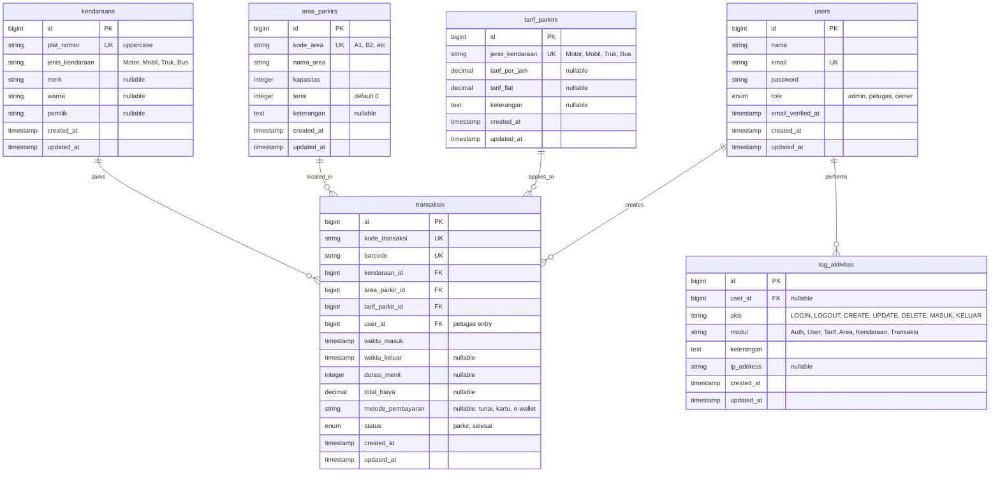

# Database Entity Relationship Diagram
## SmartPark Parking System

## Entity Relationship Diagram



## Database Schema Details

### Table: users
**Purpose:** Store system users with role-based access control

| Column | Type | Constraints | Description |
|--------|------|-------------|-------------|
| id | BIGINT | PK, AUTO_INCREMENT | Unique user identifier |
| name | VARCHAR(255) | NOT NULL | User full name |
| email | VARCHAR(255) | UNIQUE, NOT NULL | Login email |
| password | VARCHAR(255) | NOT NULL | Hashed password (bcrypt) |
| role | ENUM | NOT NULL, DEFAULT 'petugas' | admin/petugas/owner |
| email_verified_at | TIMESTAMP | NULLABLE | Email verification time |
| created_at | TIMESTAMP | NOT NULL | Record creation time |
| updated_at | TIMESTAMP | NOT NULL | Last update time |

**Indexes:**
- PRIMARY KEY (id)
- UNIQUE (email)
- INDEX (role)

---

### Table: tarif_parkirs
**Purpose:** Store parking tariff rates per vehicle type

| Column | Type | Constraints | Description |
|--------|------|-------------|-------------|
| id | BIGINT | PK, AUTO_INCREMENT | Unique tariff identifier |
| jenis_kendaraan | VARCHAR(255) | UNIQUE, NOT NULL | Vehicle type |
| tarif_per_jam | DECIMAL(10,2) | NULLABLE | Hourly rate |
| tarif_flat | DECIMAL(10,2) | NULLABLE | Flat rate |
| keterangan | TEXT | NULLABLE | Additional notes |
| created_at | TIMESTAMP | NOT NULL | Record creation time |
| updated_at | TIMESTAMP | NOT NULL | Last update time |

**Indexes:**
- PRIMARY KEY (id)
- UNIQUE (jenis_kendaraan)

**Business Rules:**
- Either tarif_per_jam OR tarif_flat must have value
- If tarif_flat exists, use flat rate
- Otherwise calculate: hours × tarif_per_jam

---

### Table: area_parkirs
**Purpose:** Manage parking areas and their capacity

| Column | Type | Constraints | Description |
|--------|------|-------------|-------------|
| id | BIGINT | PK, AUTO_INCREMENT | Unique area identifier |
| kode_area | VARCHAR(255) | UNIQUE, NOT NULL | Area code (A1, B2) |
| nama_area | VARCHAR(255) | NOT NULL | Area name |
| kapasitas | INT | NOT NULL | Maximum capacity |
| terisi | INT | NOT NULL, DEFAULT 0 | Current occupied |
| keterangan | TEXT | NULLABLE | Additional notes |
| created_at | TIMESTAMP | NOT NULL | Record creation time |
| updated_at | TIMESTAMP | NOT NULL | Last update time |

**Indexes:**
- PRIMARY KEY (id)
- UNIQUE (kode_area)

**Business Rules:**
- terisi <= kapasitas (enforced in app)
- terisi increments on vehicle entry
- terisi decrements on vehicle exit

---

### Table: kendaraans
**Purpose:** Vehicle registry for all parked vehicles

| Column | Type | Constraints | Description |
|--------|------|-------------|-------------|
| id | BIGINT | PK, AUTO_INCREMENT | Unique vehicle identifier |
| plat_nomor | VARCHAR(255) | UNIQUE, NOT NULL | License plate (uppercase) |
| jenis_kendaraan | VARCHAR(255) | NOT NULL | Vehicle type |
| merk | VARCHAR(255) | NULLABLE | Vehicle brand |
| warna | VARCHAR(255) | NULLABLE | Vehicle color |
| pemilik | VARCHAR(255) | NULLABLE | Owner name |
| created_at | TIMESTAMP | NOT NULL | Record creation time |
| updated_at | TIMESTAMP | NOT NULL | Last update time |

**Indexes:**
- PRIMARY KEY (id)
- UNIQUE (plat_nomor)
- INDEX (jenis_kendaraan)

**Business Rules:**
- plat_nomor is always uppercase
- Automatically created if not exists during entry

---

### Table: transaksis
**Purpose:** Core transaction table for parking entry/exit

| Column | Type | Constraints | Description |
|--------|------|-------------|-------------|
| id | BIGINT | PK, AUTO_INCREMENT | Unique transaction identifier |
| kode_transaksi | VARCHAR(255) | UNIQUE, NOT NULL | Transaction code (TRX-YYYYMMDD-XXXXX) |
| barcode | VARCHAR(255) | UNIQUE, NOT NULL | Unique barcode for scanning |
| kendaraan_id | BIGINT | FK, NOT NULL | Reference to kendaraans |
| area_parkir_id | BIGINT | FK, NOT NULL | Reference to area_parkirs |
| tarif_parkir_id | BIGINT | FK, NOT NULL | Reference to tarif_parkirs |
| user_id | BIGINT | FK, NOT NULL | Entry officer (users) |
| waktu_masuk | TIMESTAMP | NOT NULL | Entry timestamp |
| waktu_keluar | TIMESTAMP | NULLABLE | Exit timestamp |
| durasi_menit | INT | NULLABLE | Duration in minutes |
| total_biaya | DECIMAL(10,2) | NULLABLE | Total parking fee |
| metode_pembayaran | VARCHAR(255) | NULLABLE | tunai/kartu/e-wallet |
| status | ENUM | NOT NULL, DEFAULT 'parkir' | parkir/selesai |
| created_at | TIMESTAMP | NOT NULL | Record creation time |
| updated_at | TIMESTAMP | NOT NULL | Last update time |

**Indexes:**
- PRIMARY KEY (id)
- UNIQUE (kode_transaksi)
- UNIQUE (barcode)
- FOREIGN KEY (kendaraan_id) REFERENCES kendaraans(id) ON DELETE CASCADE
- FOREIGN KEY (area_parkir_id) REFERENCES area_parkirs(id) ON DELETE CASCADE
- FOREIGN KEY (tarif_parkir_id) REFERENCES tarif_parkirs(id) ON DELETE CASCADE
- FOREIGN KEY (user_id) REFERENCES users(id) ON DELETE CASCADE
- INDEX (status)
- INDEX (waktu_masuk)
- INDEX (waktu_keluar)

**Business Rules:**
- status = 'parkir': active parking (waktu_keluar is null)
- status = 'selesai': completed (waktu_keluar is set)
- barcode is scanned during exit to find transaction
- durasi_menit = TIMESTAMPDIFF(MINUTE, waktu_masuk, waktu_keluar)
- total_biaya calculated based on tarif_parkir

---

### Table: log_aktivitas
**Purpose:** Audit trail for all system activities

| Column | Type | Constraints | Description |
|--------|------|-------------|-------------|
| id | BIGINT | PK, AUTO_INCREMENT | Unique log identifier |
| user_id | BIGINT | FK, NULLABLE | User who performed action |
| aksi | VARCHAR(255) | NOT NULL | Action type |
| modul | VARCHAR(255) | NOT NULL | Module/feature name |
| keterangan | TEXT | NOT NULL | Detailed description |
| ip_address | VARCHAR(255) | NULLABLE | User IP address |
| created_at | TIMESTAMP | NOT NULL | Log creation time |
| updated_at | TIMESTAMP | NOT NULL | Last update time |

**Indexes:**
- PRIMARY KEY (id)
- FOREIGN KEY (user_id) REFERENCES users(id) ON DELETE SET NULL
- INDEX (aksi)
- INDEX (modul)
- INDEX (created_at)

**Log Actions:**
- LOGIN: User login
- LOGOUT: User logout
- CREATE: Create new record
- UPDATE: Update existing record
- DELETE: Delete record
- MASUK: Vehicle entry
- KELUAR: Vehicle exit

---

## Relationships

### 1. users → transaksis (1:N)
- One user can create many transactions
- FK: transaksis.user_id → users.id
- Purpose: Track which officer processed the entry

### 2. kendaraans → transaksis (1:N)
- One vehicle can have many parking transactions
- FK: transaksis.kendaraan_id → kendaraans.id
- Purpose: Link transaction to specific vehicle

### 3. area_parkirs → transaksis (1:N)
- One parking area can have many transactions
- FK: transaksis.area_parkir_id → area_parkirs.id
- Purpose: Track which area vehicle is parked

### 4. tarif_parkirs → transaksis (1:N)
- One tariff applies to many transactions
- FK: transaksis.tarif_parkir_id → tarif_parkirs.id
- Purpose: Determine pricing for transaction

### 5. users → log_aktivitas (1:N)
- One user can have many activity logs
- FK: log_aktivitas.user_id → users.id
- Purpose: Audit trail per user

---

## Database Queries Examples

### Get Active Parking Transactions
```sql
SELECT t.*, k.plat_nomor, a.nama_area, u.name as petugas
FROM transaksis t
JOIN kendaraans k ON t.kendaraan_id = k.id
JOIN area_parkirs a ON t.area_parkir_id = a.id
JOIN users u ON t.user_id = u.id
WHERE t.status = 'parkir'
ORDER BY t.waktu_masuk DESC;
```

### Calculate Daily Revenue
```sql
SELECT DATE(waktu_keluar) as tanggal,
       COUNT(*) as total_transaksi,
       SUM(total_biaya) as total_pendapatan
FROM transaksis
WHERE status = 'selesai'
  AND DATE(waktu_keluar) = CURDATE()
GROUP BY DATE(waktu_keluar);
```

### Get Area Capacity Status
```sql
SELECT kode_area, nama_area, kapasitas, terisi,
       (kapasitas - terisi) as sisa,
       ROUND((terisi / kapasitas * 100), 2) as persentase_terisi
FROM area_parkirs
ORDER BY persentase_terisi DESC;
```

### Find Transaction by Barcode
```sql
SELECT t.*, k.plat_nomor, k.jenis_kendaraan,
       a.nama_area, tp.tarif_flat, tp.tarif_per_jam
FROM transaksis t
JOIN kendaraans k ON t.kendaraan_id = k.id
JOIN area_parkirs a ON t.area_parkir_id = a.id
JOIN tarif_parkirs tp ON t.tarif_parkir_id = tp.id
WHERE t.barcode = ? AND t.status = 'parkir';
```

---

## Indexing Strategy

**For Performance Optimization:**

1. **Primary Keys**: All tables have AUTO_INCREMENT primary keys
2. **Foreign Keys**: Indexed automatically for JOIN performance
3. **Unique Constraints**: plat_nomor, kode_transaksi, barcode, email
4. **Search Indexes**: 
   - status (frequent WHERE clause)
   - waktu_masuk, waktu_keluar (date range queries)
   - role (access control filtering)
   - aksi, modul (log filtering)

**Query Optimization Tips:**
- Use EXPLAIN to analyze query execution
- Add composite indexes for frequent multi-column searches
- Consider partitioning transaksis table by date for large datasets
- Archive old log_aktivitas records periodically

