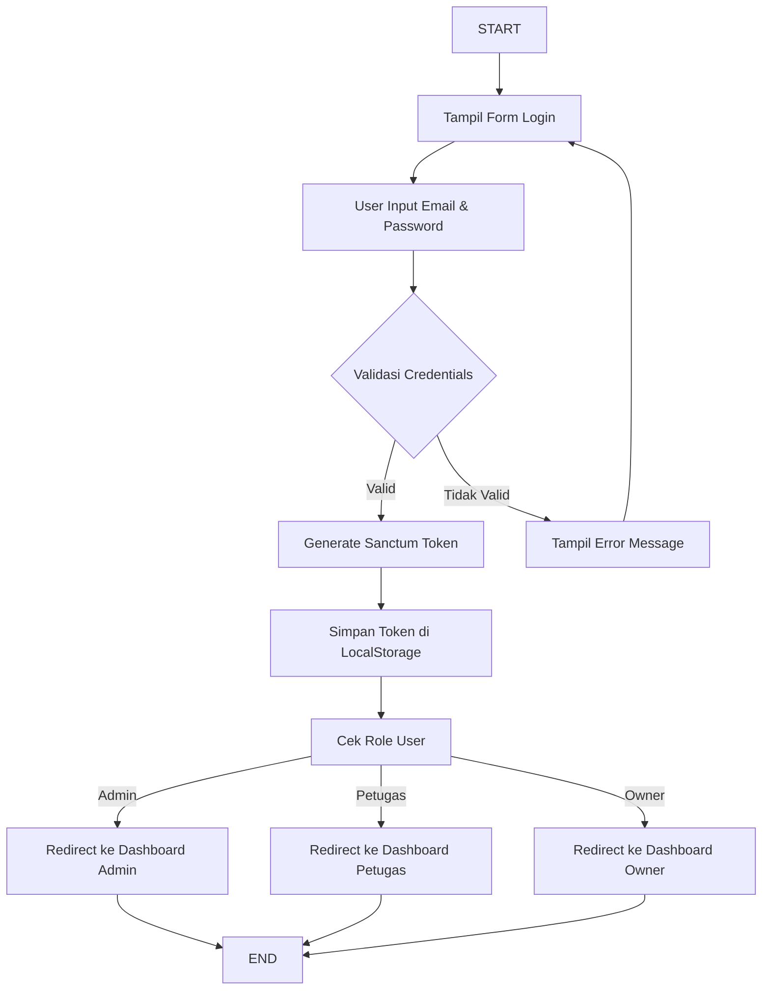
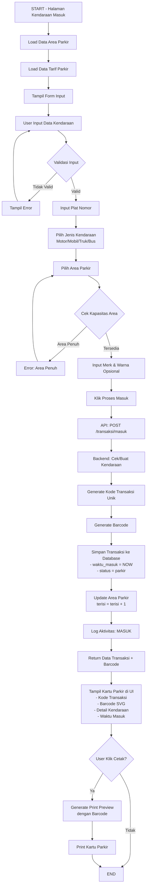
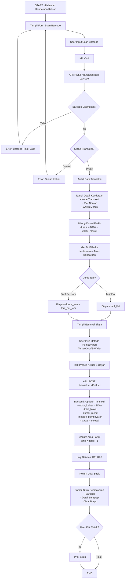
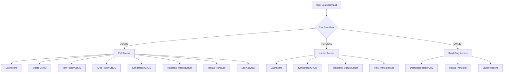
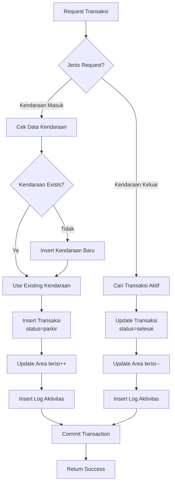
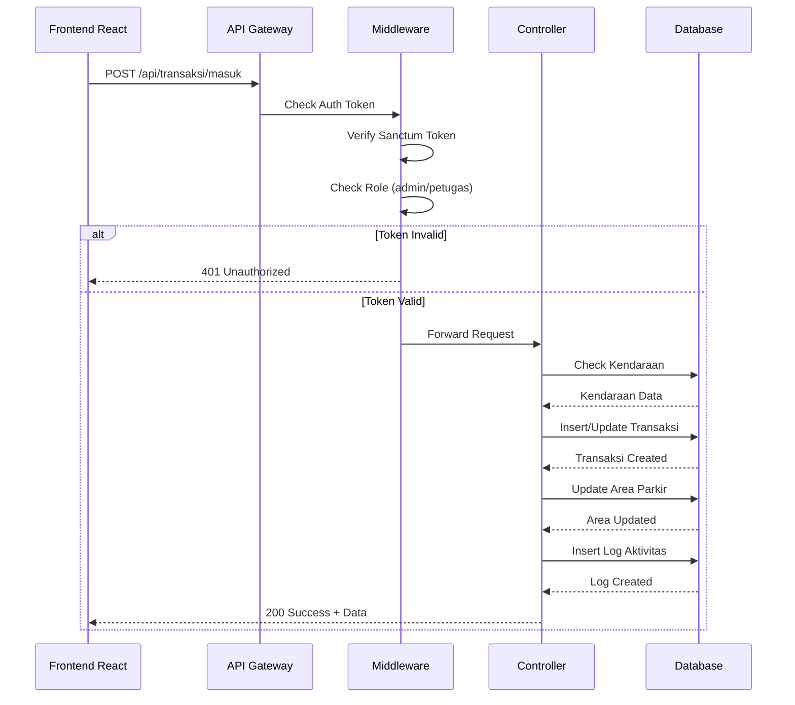
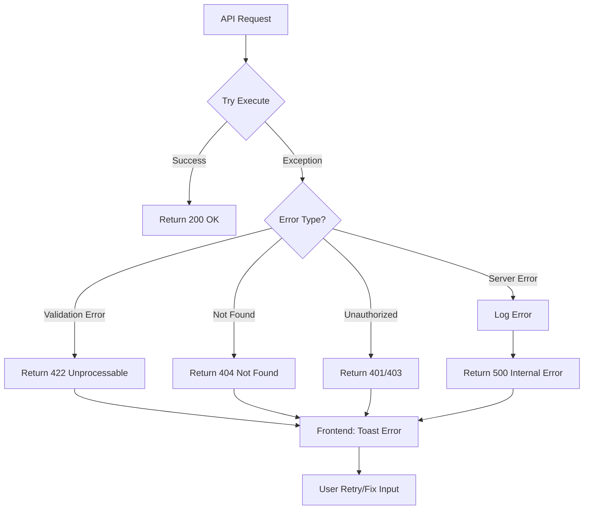
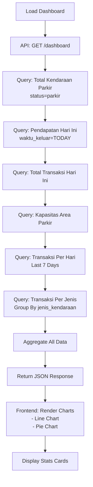

# Flowchart Sistem Parkir SmartPark

## 1. Flow Diagram Sistem Login

## 2. Flow Diagram Kendaraan Masuk (Transaksi Entry)

## 3. Flow Diagram Kendaraan Keluar (Transaksi Exit)

## 4. Role-Based Access Control Flow

## 5. Database Transaction Flow

## 6. API Request Flow

## 7. Error Handling Flow

## 8. Dashboard Stats Calculation Flow

---

## Install Extension untuk Preview

1. **Install Extension di VS Code/Windsurf:**
   - Cari "Markdown Preview Mermaid Support"
   - Install extension tersebut

2. **Cara Melihat Diagram:**
   - Buka file `FLOWCHART.md`
   - Klik icon preview (Ctrl+Shift+V)
   - Diagram Mermaid akan ter-render otomatis

3. **Export ke Image:**
   - Klik kanan pada diagram
   - Copy as PNG/SVG

